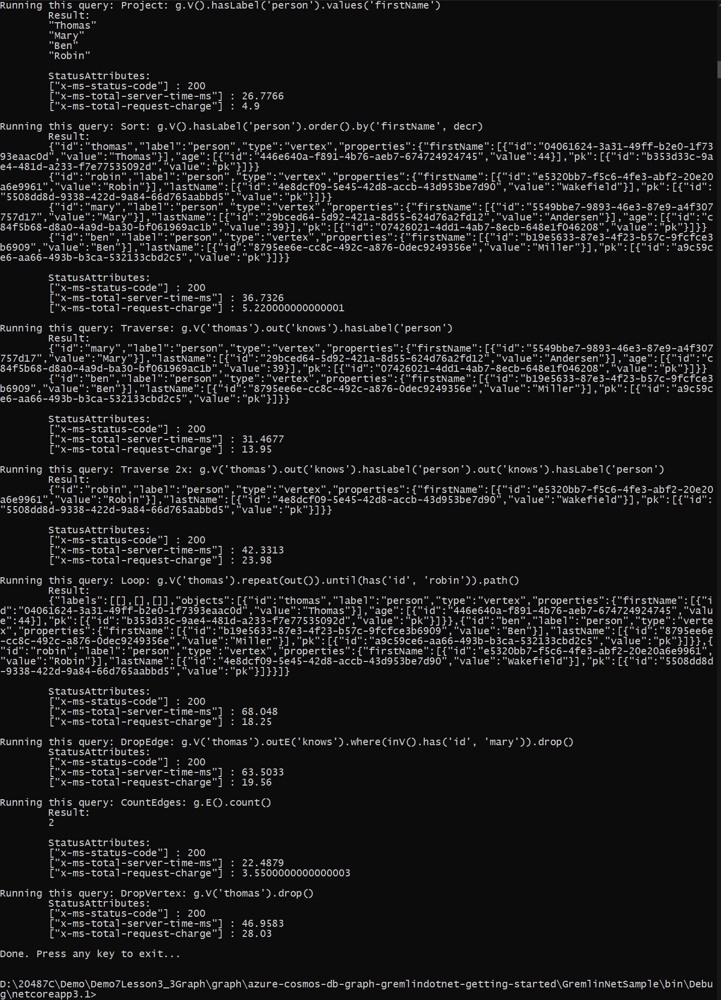

# Module 7: Implementing data storage in Azure

# Lesson 3: Working with Structured Data in Azure

### Demonstration: Using Microsoft Azure Cosmos DB with the MongoDB API

- Creamos una cuenta de Azure Cosmos DB **fjmq** del tipo Gremlin(graph)

  


- Añadimos un nuevo Grafico  con un nuevo ID de basededatos graphdb

- Abrimos el proyecto **azure-cosmos-db-graph-gremlindotnet-getting-started**

- Nos fijamos que recoge las variables de entorno host, DataBaseName, ContainerName y PrimaryKey por lo tanto las rellenamos desde la linea de comandos

  

  

- Ejecutamos el proyecto

   ```json
    {}
   ```



- Para ver el grafico escribimos

   ```query
   g.V()
   ```


